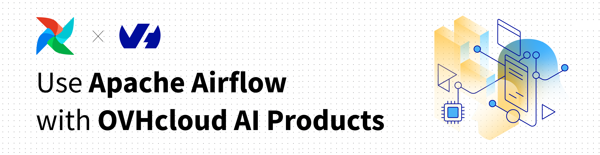

# Apache Airflow Provider for OVHcloud AI



This package provides Apache Airflow integration with [OVHcloud AI products](https://www.ovhcloud.com/en/public-cloud/ai-endpoints/): 
- **AI Endpoints**: an OpenAI-compatible API service for running LLM inference
- **AI Training**: managed training jobs on GPU clusters with full lifecycle management

## Documentation

The documentation can be found [here](https://ovh.github.io/apache-airflow-provider-ovhcloud-ai). You will find all informations on how to create your DAGs and automations for our AI products in Apache Airflow.

## Development

### Setup Development Environment

```bash
# Clone the repository
git clone https://github.com/ovh/apache-airflow-provider-ovhcloud-ai.git
cd apache-airflow-provider-ovhcloud-ai

# Create virtual environment
python -m venv venv
source venv/bin/activate  # On Windows: venv\Scripts\activate

# Install in development mode
pip install -e ".[dev]"
```

### Run Tests

```bash
pytest tests/
```

### Code Formatting

```bash
black apache_airflow_provider_ovhcloud_ai/
flake8 apache_airflow_provider_ovhcloud_ai/
mypy apache_airflow_provider_ovhcloud_ai/
```

## Contributing

Contributions are welcome! Please:

1. Fork the repository
2. Create a feature branch (`git checkout -b feature/amazing-feature`)
3. Commit your changes (`git commit -m 'Add amazing feature'`)
4. Push to the branch (`git push origin feature/amazing-feature`)
5. Open a Pull Request

## License

This project is licensed under the Apache License 2.0 - see the [LICENSE](LICENSE) file for details.

## Support

- 📖 [Documentation](https://github.com/ovh/apache-airflow-provider-ovhcloud-ai#readme)
- 🐛 [Issue Tracker](https://github.com/ovh/apache-airflow-provider-ovhcloud-ai/issues)
- 💬 [Discussions](https://github.com/ovh/apache-airflow-provider-ovhcloud-ai/discussions)

## Acknowledgments

- Built for [Apache Airflow](https://airflow.apache.org/)